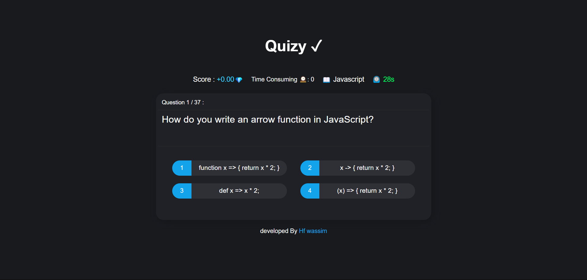

# Quizy App Documentation

---

## **Quizy App Overview**
**Quizy** is an interactive quiz application designed to challenge users with questions and track their performance over time. It includes dynamic feedback, personalized messages, and time management features to enhance user engagement and learning. The app is developed by **Hf Wassim** with a focus on user-friendly design, efficient development practices, and seamless performance.

---

## **Features**

### 1. **Dynamic Scoring and Feedback**
- **Scoring System:** Calculates the user's score out of 100 based on their correct answers.
- **Feedback System:** Provides personalized feedback based on performance:
  - **Below 50%:** Displays encouragement and guidance for improvement.
  - **50% or Higher:** Congratulates the user on winning with motivational messages.

### 2. **Time Management**
- **Countdown Timer:** Tracks the remaining time for the quiz, updating dynamically with:
  - **Green:** Safe time remaining.
  - **Yellow:** Warning zone (less than 10 seconds left).
  - **Red:** Critical time (less than 5 seconds left).
- **Total Time Consumed:** Displays the time spent on the quiz for transparency and user awareness.

### 3. **Motivational Messages**
- Tailored messages encourage users based on their performance level:
  - Suggestions for improvement.
  - Positive reinforcement for good performance.

### 4. **Interactive Game Flow**
- **Start and Restart Functions:**
  - `startGame()` initializes the quiz.
  - Users can restart the game with a "Play Again" button after completing the quiz.

### 5. **Custom Timer Functions**
- A robust timer that:
  - Dynamically updates colors and time display.
  - Stops automatically when the quiz ends.
  - Provides real-time feedback on the remaining time.

### 6. **Clean and Optimized Code**
- **Best Practices in JavaScript:**
  - Modular structure for reusability.
  - Readable and maintainable variable names.
  - Optimization of timer and event-handling logic.
- **Dynamic DOM Manipulation:**
  - Updates HTML content using JavaScript.
  - Ensures smooth transitions and animations for a better user experience.

---

## **Technologies Used**

### 1. **Frontend Development**
- **HTML:** Provides the structure for the app's interface.
- **CSS:** Adds styles, animations, and dynamic colors to enhance the UI.
- **JavaScript:** Powers the app's interactivity and logic, including:
  - Timer functionality.
  - Score calculation.
  - User feedback and dynamic message updates.

### 2. **Event Handling**
- `DOMContentLoaded` event ensures the app initializes only after the DOM is fully loaded.
- Custom event listeners manage user interactions efficiently.

### 3. **Dynamic DOM Manipulation**
- Uses JavaScript to update quiz results, timer, and motivational messages in real-time.

---

## **Developer Information**
- **Name:** Hf Wassim
- **Contact Details:**
  - **Phone:** +216 23247728
  - **Email:** hafsi.wassim010@gmail.com
  - **Instagram:** [hfwassim_](https://www.instagram.com/hfwassim_/)

**Quizy** is built with passion and precision, reflecting Wassim's dedication to creating high-quality software solutions. The app demonstrates modern development practices, user-focused design, and efficient coding techniques.

---

## **Future Updates**
Planned enhancements for **Quizy**:
- Adding Image-Based Questions.
- Discontinuation of User Profile Tracking.
- Adding a leaderboard for competitive scoring.
- Integrating with APIs for dynamic question sets.
- Implementing user authentication for personalized quiz sessions.
